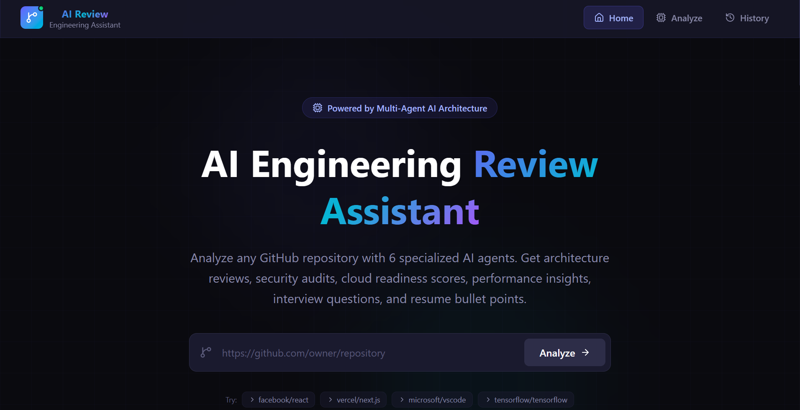
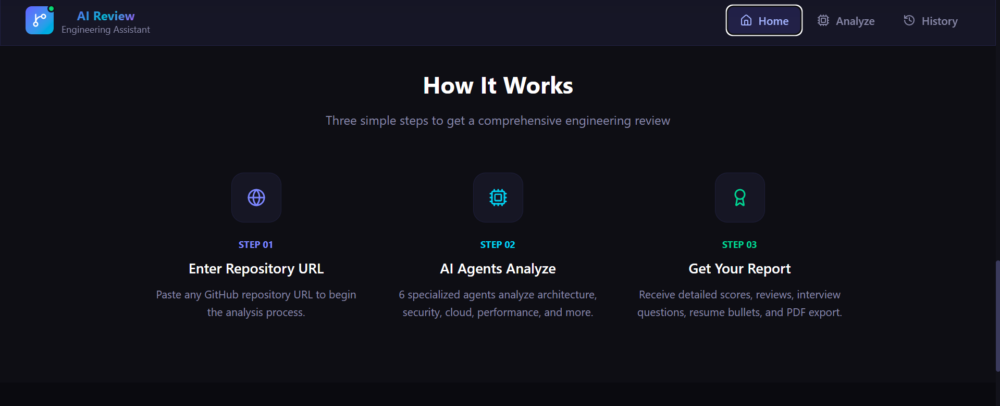
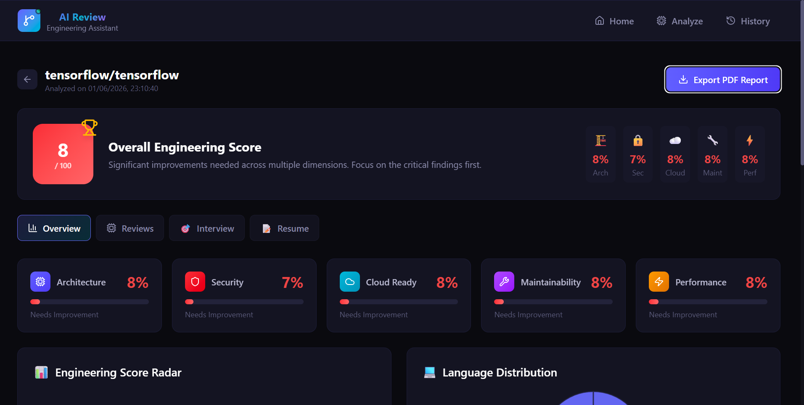
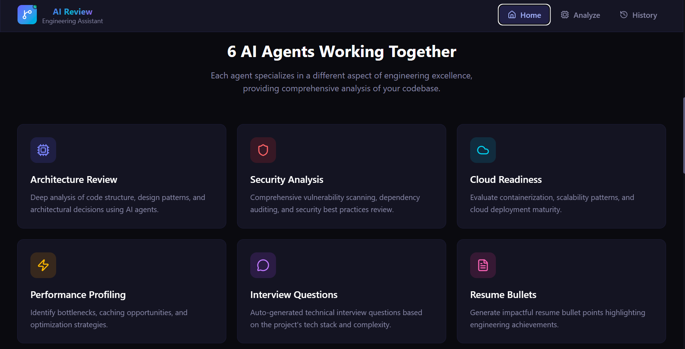
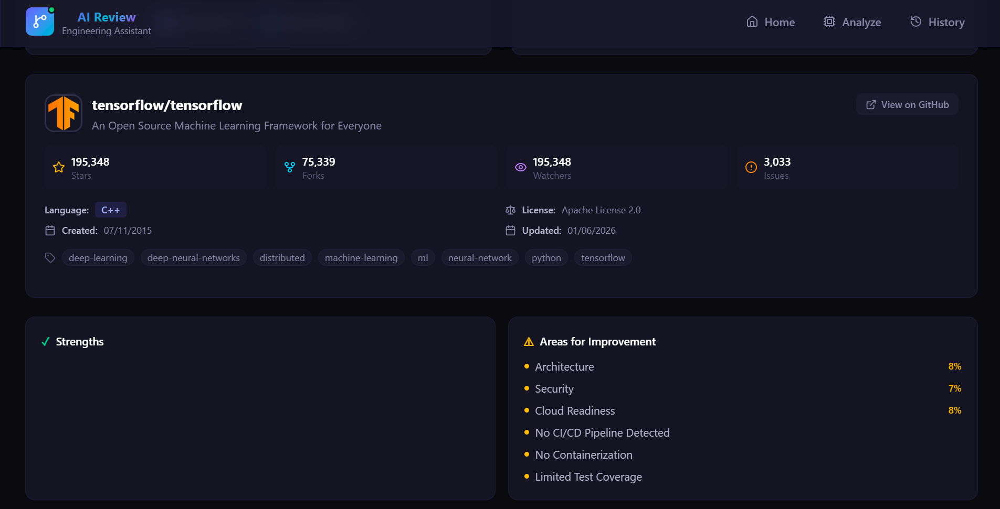
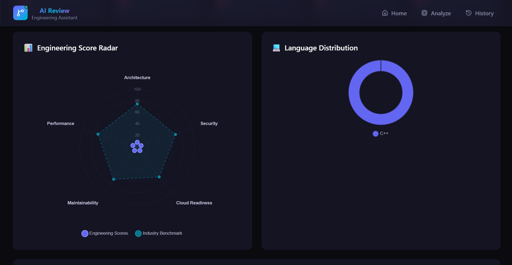
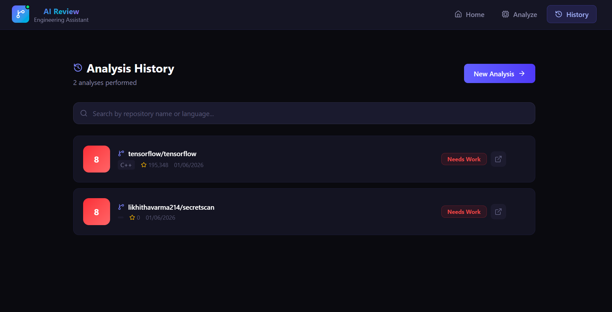

# 🚀 AI Engineering Review Assistant

An AI-powered platform that analyzes GitHub repositories and generates architecture reviews, security assessments, cloud-readiness recommendations, engineering insights, interview questions, and resume bullet points using Large Language Models (LLMs).

---

## 📌 Overview

AI Engineering Review Assistant helps developers, recruiters, engineering managers, and students quickly evaluate software repositories.

The platform fetches repository information from GitHub and uses AI-powered analysis agents to provide:

* Architecture Review
* Security Review
* Cloud Readiness Assessment
* Engineering Quality Score
* Interview Questions
* Resume Bullet Points

---

## ✨ Features

### 🔍 Repository Analysis

Analyze any public GitHub repository.

Example:

https://github.com/facebook/react

---

### 🏗 Architecture Review Agent

Provides:

* Architecture strengths
* Architecture weaknesses
* Scalability recommendations
* Maintainability suggestions

---

### 🔐 Security Review Agent

Identifies:

* Potential security concerns
* Authentication recommendations
* Security best practices
* OWASP-related observations

---

### ☁️ Cloud Readiness Review

Generates:

* AWS deployment suggestions
* Docker recommendations
* CI/CD recommendations
* Scalability improvements

---

### 🎯 Engineering Score

Evaluates:

* Architecture
* Security
* Cloud Readiness
* Maintainability
* Performance

Generates an overall engineering score.

---

### 🎤 Interview Question Generator

Automatically generates repository-specific technical interview questions.

---

### 📄 Resume Bullet Generator

Creates professional resume-ready bullet points based on repository architecture and engineering practices.

---
### 🏗 Export feature is also available!!


## 🛠 Tech Stack

### Frontend

* React
* Vite
* JavaScript
* Axios
* Tailwind CSS
* Chart.js

### Backend

* FastAPI
* Python
* Pydantic
* Requests

### AI

* Ollama
* Llama 3

### External Services

* GitHub REST API

---

## 🏛 Architecture

GitHub Repository URL

↓

GitHub API Service

↓

Repository Metadata Extraction

↓

AI Analysis Layer

├── Architecture Agent

├── Security Agent

├── Cloud Agent

├── Interview Agent

└── Resume Agent

↓

Scoring Engine

↓

React Dashboard

---

## 📷 Application Screenshots

### Dashboard




### Repository Analysis



### Architecture Review


### Repository Review




### History



## 🚀 Installation

### Clone Repository

```bash
git clone https://github.com/YOUR_USERNAME/ai-engineering-review-assistant.git

cd ai-engineering-review-assistant
```

---

### Backend Setup

```bash
cd backend

python -m venv venv

venv\Scripts\activate

pip install -r requirements.txt

uvicorn app:app --reload
```

Backend runs at:

```text
http://127.0.0.1:8000
```

---

### Install Ollama

Download:

https://ollama.com

Pull model:

```bash
ollama pull llama3
```

Run:

```bash
ollama run llama3
```

---

### Frontend Setup

```bash
cd frontend

npm install

npm run dev
```

Frontend runs at:

```text
http://localhost:5173
```

---

## 🔮 Future Enhancements

* PDF Report Export
* Multi-Agent Orchestration
* Repository Comparison
* Team Analytics Dashboard
* GitHub Pull Request Reviews
* Kubernetes Readiness Review
* Dockerfile Analysis
* CI/CD Workflow Evaluation

---

## 👩‍💻 Author

Likhitha Varma Chinta

## ⭐ Project Status

Active Development

Currently improving:

* Frontend ↔ Backend integration
* Repository intelligence
* Multi-agent orchestration
* AI-generated engineering recommendations
